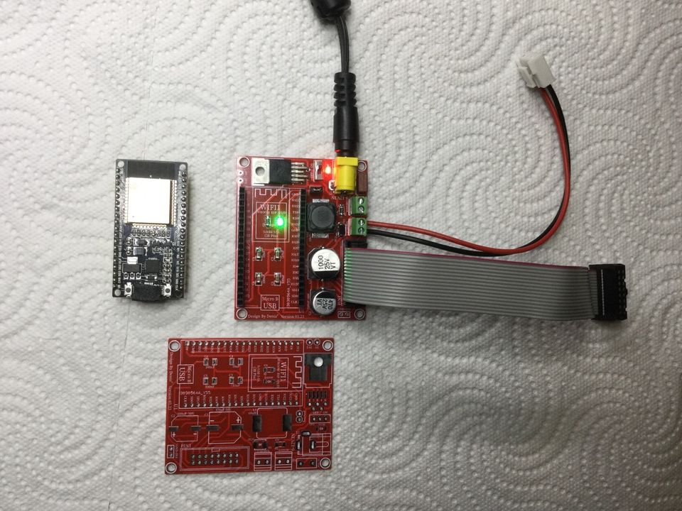
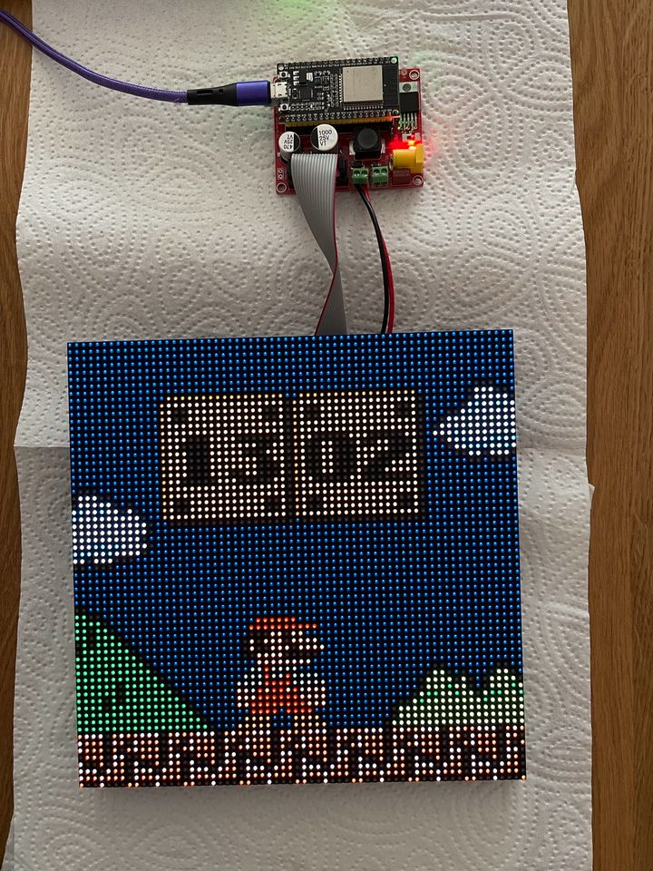

# Mario-Clock-PCB-ESP32

This is a PCB project able to drive a RGB Led Matrix compatible with [Mario Clock/Clockwise](https://clockwise.page/) 

This repository contains all gerber files of the project.

